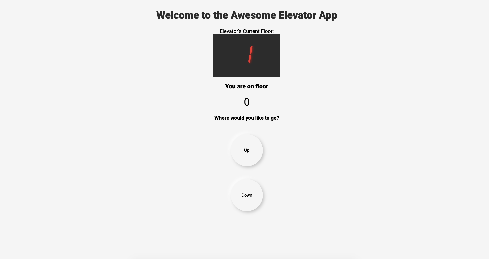
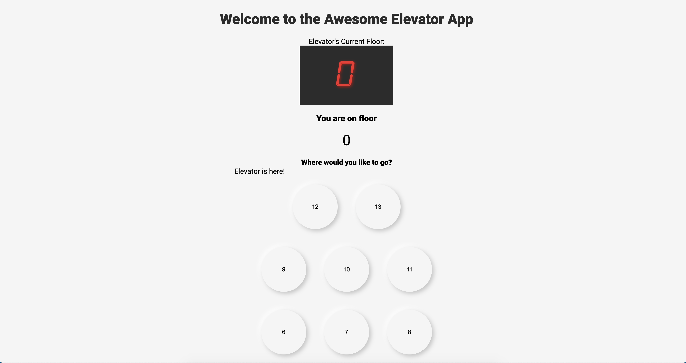

# Awesome Elevator App

Welcome to the awesome elevator app. Written by Javier Gonzalez in vanilla js, HTML, and CSS.

Link to the project: [Awesome Elevator](https://javier123454321.github.io/awesome_elevator/)

To run it locally, just download the repository, do an `npm install` and boot it with a local server, whether apache, nginx, or a simple php server that can be accessed after installing php and running `php -S localhost:8000`.

### To Use:
Select up or down on the home screen to call the elevator to your floor:

Then, select a floor

Straight forward and simple. Once floor is selected, go to the desired floor.

The project relies heavily on ES6's module declarations to keep the it modular and manageable. Its entrypoint is in the mount.js file that is on the src directory and declares the files necessary for setup. The business logic is handled in individual files under the functions directory, and the presentation layer is handled in the renderFunctions.js module.

The UI was done in line with the trend of Neumorphism, which I have my skepticism of, specially when it comes to the contrast ratio, and a more philosophical disagreement with making websites appear something which they are not. A screen is not a three dimensional button, no matter how precisely calculated a drop shadow you give it. Deciding to build a UI is also a risky move, as much of the conversation can be derailed away from things that are the core of the functionality on projects like this. Nontheless, it is an interesting style that can leave stunning results if done right. It seemed simple enough of a project to experiment with it here. 

### Testing
The app was built with an emphasis on testing. To run the test suites, just run `npm run test` or `npm run test:watch` to listen for changes as the files are modified. It was done with Jest, and has most of the features implemented in a Test Driven Development fashion.

#### Known issues
Too many to tell here. Notably, the up or down buttons currently have equivalent functionality. Pull Requests are welcome :)